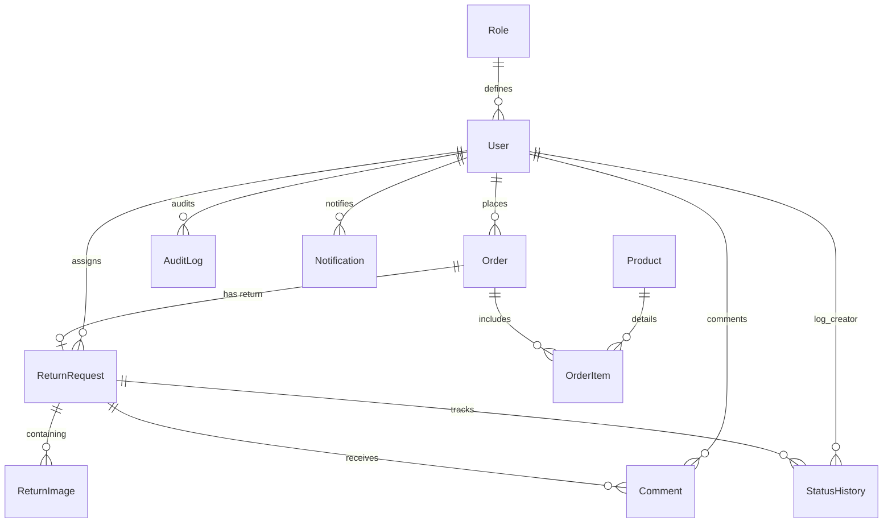

# Return/Replacement Request System

A modern, responsive, and animated Return and Replacement Management Workspace built specifically for a Personalized Gift Store. The system allows customers to raise return/replacement requests with image uploads and comments, while allowing support executives and administrators to triage, assign, update, and analyze requests.

---

## Technical Architecture

```mermaid
graph TD
    subgraph Frontend (Vercel / React)
        Client[React Single Page Application]
        State[AuthContext / ToastContext]
        AXIOS[Axios API Client + Interceptors]
    end

    subgraph Backend (Render / Node.js)
        Server[Express App]
        MW[Auth, RBAC, Multer Middlewares]
        Controller[Controllers: Auth, Returns, Dashboard, Users]
        PRISMA[Prisma ORM]
    end

    subgraph Storage & Services
        DB[(Neon PostgreSQL Database)]
        Cloudinary[Cloudinary Cloud Storage]
        SMTP[SMTP Email Server]
    end

    Client --> State
    State --> AXIOS
    AXIOS -->|JWT Secure API Calls| Server
    Server --> MW
    MW --> Controller
    Controller --> PRISMA
    PRISMA -->|SQL Dialect| DB
    Controller -->|Nodemailer Notification| SMTP
    Controller -->|Memory Buffer upload| Cloudinary
```

---

## Database ER Diagram (Relational Schema)



---

## Core Features

### Customer Features
- **Account Registration & Login**: Secured with Argon2/bcrypt hashes.
- **Stateless Forgot Password Flow**: Secure recovery links compiled using dynamic secret hashing.
- **Create Return Request**: Choose between refund or replacement, supply customer contact, pick problem type, write description, upload multiple images (up to 5, max 5MB/each), accept terms, and submit.
- **Track Status**: Visual timeline showing transitions from `PENDING` to `CLOSED`.
- **Public Messaging**: Direct comment threads with support agents.
- **Cancel Request**: Delete/cancel return submissions that are still in `PENDING` status.

### Admin & Support Features
- **Interactive Analytics Board**: Recharts counters (Total, Pending, Approved), submission trends line charts, and issue distribution pie charts.
- **Request Management**: Search, sort, and paginated logs. Filter records by status, resolution, and issue types.
- **Support Assignments**: Assign specific support executives to individual request cases.
- **Status Progression**: Progress requests from under-review, through approvals, to replacement/refund initiation, shipment, and closing.
- **Confidential Internal Notes**: Log internal support communications hidden from customers.
- **Privilege Control**: Promote customers to Support Executive or Admin roles.
- **Export Data**: Secured, token-authenticated CSV exports.

---

## Project Directory Layout

```text
return-replacement-system/
├── backend/
│   ├── prisma/
│   │   ├── schema.prisma        # Prisma relational database definitions
│   │   └── seed.ts             # Database seeds (Default accounts, products, mock orders)
│   ├── src/
│   │   ├── config/             # DB, Mailer, Cloudinary & JWT configs
│   │   ├── controllers/        # Express router actions (MVC)
│   │   ├── middlewares/        # Authentication validation, uploads & error-handlers
│   │   ├── routes/             # Core routing definitions
│   │   ├── types/              # Request / payload typing
│   │   ├── index.ts            # Server entry point
│   │   └── index.test.ts       # Backend integration tests
│   ├── tsconfig.json
│   └── package.json
└── frontend/
    ├── public/
    ├── src/
    │   ├── components/         # Navigation, Layout, Skeletons & Protected routes
    │   ├── context/            # AuthContext & ToastContext providers
    │   ├── pages/              # Login, Sign Up, Dashboard & Forms
    │   ├── services/           # Axios Client API configs with Interceptors
    │   ├── types/              # Typings aligning with database models
    │   ├── App.tsx             # Route configurations
    │   ├── main.tsx            # DOM mounting
    │   └── index.css           # Styling directive definitions
    ├── postcss.config.js
    ├── tailwind.config.js
    └── package.json
```

---

## Setup & Environment Configuration

### Prerequisites
- Node.js (v18+)
- PostgreSQL Database instance

### 1. Backend Setup
1. Open the backend directory:
   ```bash
   cd backend
   ```
2. Create a `.env` file at the backend root matching the following variables:
   ```env
   PORT=5000
   DATABASE_URL="postgresql://<username>:<password>@<host>:<port>/<dbname>?schema=public"
   JWT_ACCESS_SECRET="your_jwt_access_secret_key"
   JWT_REFRESH_SECRET="your_jwt_refresh_secret_key"
   
   # Image Cloud Storage Configuration (Optional - Falls back to local disk storage if empty)
   CLOUDINARY_CLOUD_NAME="your_cloudinary_cloud_name"
   CLOUDINARY_API_KEY="your_cloudinary_api_key"
   CLOUDINARY_API_SECRET="your_cloudinary_api_secret"

   # SMTP Transactional Mail Configuration (Optional - Logs to console if empty)
   SMTP_HOST="smtp.mailtrap.io"
   SMTP_PORT=2525
   SMTP_USER="smtp_user"
   SMTP_PASS="smtp_pass"
   SMTP_FROM="no-reply@personalizedgiftstore.com"

   FRONTEND_URL="http://localhost:5173"
   ```
3. Run migrations to push the schema into your PostgreSQL database:
   ```bash
   npx prisma db push
   ```
4. Seed the database with default roles, credentials, products, and mock orders:
   ```bash
   npm run db:seed
   ```
   *This seeds a customer (`customer@giftstore.com`), support (`support@giftstore.com`), and administrator (`admin@giftstore.com`) with the password: `password123`.*
5. Run the dev server:
   ```bash
   npm run dev
   ```

### 2. Frontend Setup
1. Open the frontend directory:
   ```bash
   cd ../frontend
   ```
2. Create a `.env` file at the frontend root:
   ```env
   VITE_API_URL="http://localhost:5000/api"
   ```
3. Start the Vite React development workspace:
   ```bash
   npm run dev
   ```
4. Access the web interface at `http://localhost:5173`.

---

## API Documentation

### Authentication (`/api/auth`)
- `POST /register`: Registers a new customer account.
- `POST /login`: Logs in a user, returns a JSON access token and writes a secure HttpOnly refresh cookie.
- `POST /refresh`: Uses the refresh cookie to generate a fresh 15-minute access token.
- `POST /logout`: Invalidates the refresh token and clears client cookies.
- `POST /forgot-password`: Generates a stateless password recovery reset link.
- `POST /reset-password`: Commits a new password if the signed token verifies.

### Return Requests (`/api/returns`)
- `POST /`: Submits a return request using `multipart/form-data`.
- `GET /`: Lists return request entries (filtered dynamically depending on role permissions).
- `GET /export/csv`: Exports complete request records as comma-separated tables (Admins/Support only).
- `GET /:id`: Retrieves complete metrics, timeline logs, and comments for a return request.
- `PUT /:id`: Modifies request status, adds notes, or reassigns executives (Admins/Support only).
- `DELETE /:id`: Cancels a request (restricted to customer creator while status is `PENDING`).

### User Roles & Products (`/api/users` & `/api/products`)
- `GET /api/users`: Lists users (Admin only).
- `PUT /api/users/:id/role`: Changes user group permissions (Admin only).
- `GET /api/products`: Lists products.
- `POST /api/products`: Creates a new product catalog item (Admin only).

---

## Deployment Playbook

### Database Deployment (Neon)
1. Sign up on [Neon PostgreSQL](https://neon.tech/) and provision a new project.
2. Copy the Connection String.
3. Update your backend production environment variable `DATABASE_URL` with this connection URI.

### Backend Deployment (Render)
1. Register on [Render](https://render.com/) and create a new **Web Service**.
2. Connect your Git repository.
3. Select **Node** runtime.
4. Set the Build Command: `cd backend && npm install && npm run build`
5. Set the Start Command: `cd backend && npm start`
6. Add the environment variables defined in `.env.example` to the Render dashboard.

### Frontend Deployment (Vercel)
1. Log in to [Vercel](https://vercel.com/) and create a **New Project**.
2. Import your Git repository.
3. Configure the Root Directory to point to the `frontend/` folder.
4. Set the Build Command: `npm run build`
5. Set the Output Directory: `dist`
6. Add `VITE_API_URL` pointing to your deployed Render API backend.
